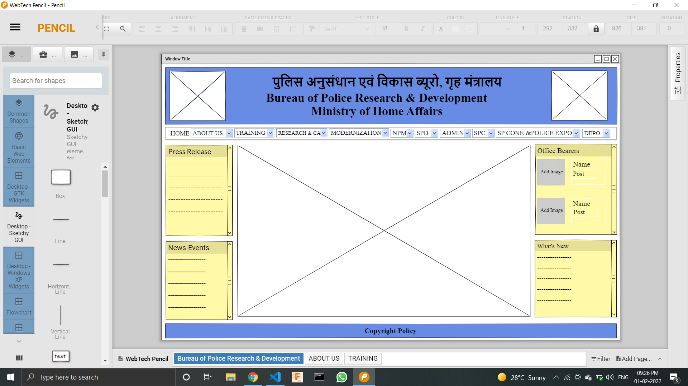

# Wire frame for a website

## AIM:
To design a wire frame for a website.

## DESIGN STEPS:

### Step 1:
The design is done using Pencil project application.
### Step 2:
The layout of the website is done using "Desktop sketchy GUI".

## OUTPUT:
### Home page:

### About Page:

### Training Page:

## Result:
Thus a wire frame is designed for a given website.
